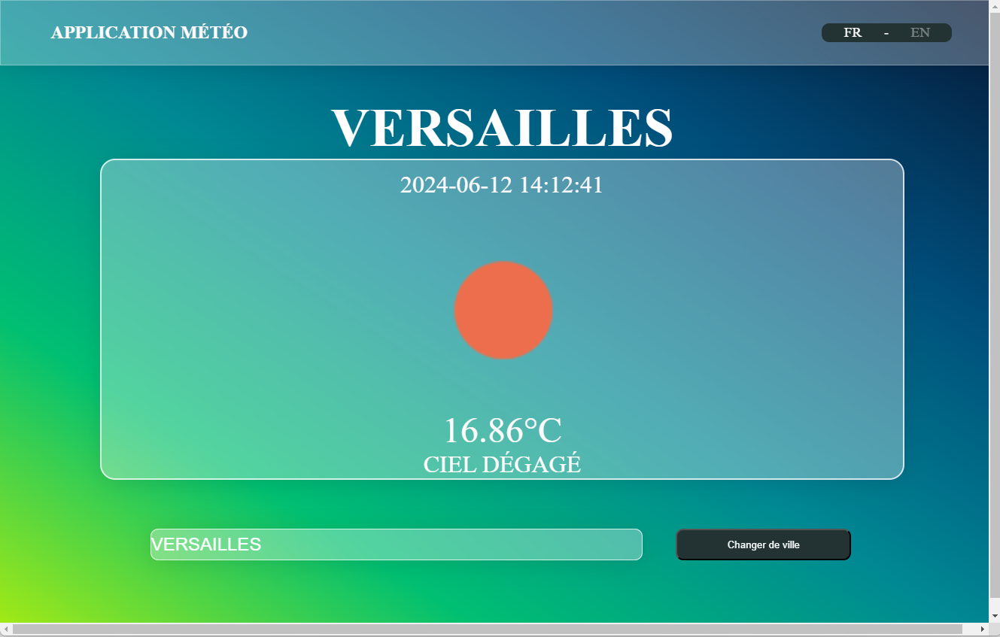

# Application Météo React

Cette application météo React vous permet de consulter les prévisions météorologiques pour différentes villes à travers le monde. Elle a été développée en utilisant React et des API de données météorologiques pour fournir des informations météorologiques précises et en temps réel. Il est possible de la traduire soit en anglais

## Fonctionnalités

- Recherche de prévisions météorologiques par ville.
- Affichage des détails météorologiques tels que la température, l'humidité, la vitesse du vent, etc.
- Prise en charge de plusieurs unités de mesure (Celsius, Fahrenheit, etc.).
- Interface utilisateur conviviale et réactive.

## Utilisation

1. Clonez ce dépôt sur votre machine locale.
2. Exécutez `npm install` pour installer les dépendances.
3. Exécutez `npm start` pour lancer l'application en mode développement.
4. Ouvrez votre navigateur et accédez à [http://localhost:3000](http://localhost:3000) pour afficher l'application.

## Langues Prises en Charge

Cette application est disponible en anglais et en français. Pour changer la langue de l'application, suivez ces étapes :

1. Ouvrez l'application météo.
2. Recherchez le bouton ou l'option de paramètres (généralement représenté par une icône d'engrenage).
3. Dans les paramètres, recherchez l'option de sélection de la langue.
4. Sélectionnez "English" pour utiliser l'application en anglais ou "Français" pour utiliser l'application en français.
5. Les changements seront appliqués immédiatement et l'application affichera le contenu dans la langue sélectionnée.

Si vous rencontrez des problèmes pour changer la langue de l'application, veuillez consulter la documentation de l'application ou contacter le support pour obtenir de l'aide supplémentaire.

## Captures d'écran

## Technologies Utilisées

- React.js
- API de données météorologiques

## Contribuer

Les contributions sont les bienvenues ! Si vous souhaitez contribuer à ce projet, veuillez ouvrir une issue pour discuter des changements que vous souhaitez apporter, ou soumettre directement une pull request.

## Remarque

Cette application météo est à des fins éducatives et de démonstration uniquement. Elle utilise des données météorologiques provenant de sources tierces et ne garantit pas l'exactitude des prévisions météorologiques.

---

Pour plus d'informations sur React et la création d'applications météo, consultez la documentation officielle de [React](https://reactjs.org/) et explorez les API météorologiques disponibles en ligne.
